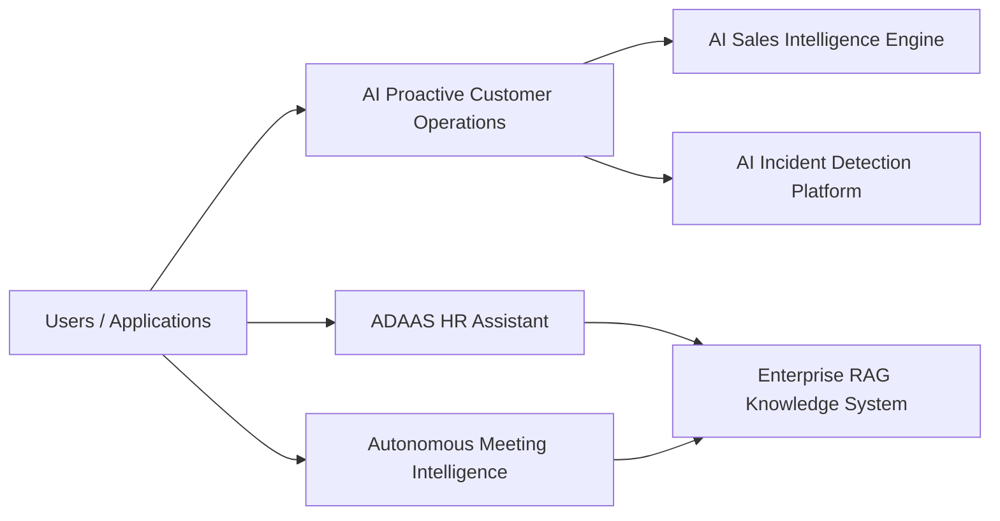

# AI Engineering Portfolio

Production-style AI systems portfolio covering retrieval, multi-agent workflows,
predictive scoring, anomaly detection, meeting intelligence, and an HR assistant
application.

## System Map



## Project Status

| Project | Role | Current runnable surface | Verification |
|---|---|---|---|
| `enterprise-rag-knowledge-system` | Retrieval and grounded answer pipeline | FastAPI `/query`, local hybrid retrieval, eval script | `python -m pytest -q`, `python evaluation/run_eval.py` |
| `ai-proactive-customer-operations` | Multi-agent customer decision workflow | FastAPI `/decide`, route/sentiment/policy/action trace | `python -m pytest -q`, `python evaluation/evaluate.py` |
| `ai-incident-detection-platform` | Operational anomaly scoring | FastAPI `/score`, telemetry feature extraction, anomaly model | `python -m pytest -q`, `python evaluation/evaluate.py` |
| `ai-sales-intelligence-engine` | Account propensity scoring | FastAPI `/score`, segment, feature explanation | `python -m pytest -q`, `python evaluation/evaluate.py` |
| `autonomous-meeting-intelligence` | Transcript structuring | FastAPI `/analyze`, schema-validated summary/actions/decisions | `python -m pytest -q`, `python evaluation/evaluate.py` |
| `ADAAS` | Flutter HR assistant and Node HR backend | Flutter app, backend `/chat`, `/leave-balance`, `/leave-application` | `flutter test`, `flutter analyze`, `npm test` |

## Runbook

Python service pattern:

```bash
cd <project>
python -m pytest -q
python evaluation/evaluate.py
uvicorn api.server:app --reload --port 8000
```

Enterprise RAG uses a named eval runner:

```bash
cd enterprise-rag-knowledge-system
python evaluation/run_eval.py
```

ADAAS:

```bash
cd ADAAS/hr-backend
npm test
npm start

cd ..
flutter test
flutter analyze
flutter run -d chrome --dart-define=HR_API_BASE_URL=http://localhost:3000
```
## Projects

## 1. enterprise-rag-knowledge-system
Core retrieval reasoning backbone using semantic chunking, reranking, and confidence scoring.
https://github.com/Adityansh-Chand/enterprise-rag-knowledge-system.git

## 2. ai-proactive-customer-operations
Explicit multi-agent DAG orchestration implementing planner → specialist → action workflow.
https://github.com/Adityansh-Chand/ai-proactive-customer-operations.git

## 3. ADAAS
Production HR assistant integrating RAG reasoning with real-time API data.
https://github.com/Adityansh-Chand/ADAAS.git

## 4. ai-sales-intelligence-engine
Predictive ML pipeline for customer intelligence scoring.
https://github.com/Adityansh-Chand/ai-sales-intelligence-engine.git

## 5. ai-incident-detection-platform
Anomaly detection system for operational intelligence.
https://github.com/Adityansh-Chand/ai-incident-detection-platform.git

## 6. autonomous-meeting-intelligence
LLM-powered structured transcript understanding pipeline.
https://github.com/Adityansh-Chand/autonomous-meeting-intelligence.git

## Shared Engineering Themes

- Typed request/response boundaries for APIs.
- Domain-specific sample data instead of generic placeholder CSVs.
- Focused tests that assert real system behavior.
- Lightweight evaluation scripts with explicit accuracy or structure metrics.
- Docker entrypoints that run FastAPI services through `uvicorn`.
- Deterministic local fallbacks where external providers are optional.

## Next Portfolio-Level Improvements

- Add CI to run each project verification command.
- Add demo screenshots or short recordings per system.
- Add a shared API contract document for common request tracing.
- Add common logging and metric naming conventions.
- Add maturity tags such as `prototype`, `demo-ready`, and `production-hardening`.

## Author

Adityansh Chand

AI Software Engineer specializing in multi-agent systems, retrieval engineering,
LLM architecture, and machine learning pipelines.
