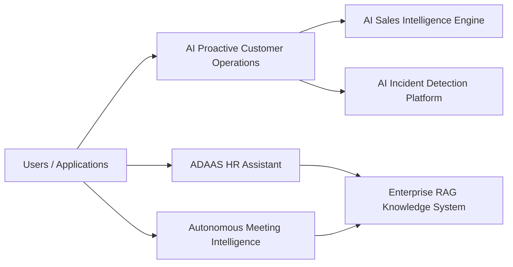

# AI Engineering Portfolio

Production-style AI systems portfolio covering retrieval, multi-agent workflows,
predictive scoring, anomaly detection, meeting intelligence, and an HR assistant
application.

## System Map



## Project Status

| Project | Role | Current runnable surface | Verification |
|---|---|---|---|
| `enterprise-rag-knowledge-system` | Retrieval and grounded answer pipeline | FastAPI `/query`, `/metrics`, SQLite event store, K8s/Compose | `python -m pytest -q`, `python evaluation/run_eval.py` |
| `ai-proactive-customer-operations` | Multi-agent customer decision workflow | FastAPI `/decide`, `/metrics`, SQLite event store, K8s/Compose | `python -m pytest -q`, `python evaluation/evaluate.py` |
| `ai-incident-detection-platform` | Operational anomaly scoring | FastAPI `/score`, `/metrics`, SQLite event store, K8s/Compose | `python -m pytest -q`, `python evaluation/evaluate.py` |
| `ai-sales-intelligence-engine` | Account propensity scoring | FastAPI `/score`, `/metrics`, SQLite event store, K8s/Compose | `python -m pytest -q`, `python evaluation/evaluate.py` |
| `autonomous-meeting-intelligence` | Transcript structuring | FastAPI `/analyze`, `/metrics`, SQLite event store, K8s/Compose | `python -m pytest -q`, `python evaluation/evaluate.py` |
| `ADAAS` | Flutter HR assistant and Node HR backend | Flutter app, secured backend, Mongo persistence, K8s/Compose | `flutter test`, `flutter analyze`, `npm test` |

## Runbook

Python service pattern:

```bash
cd <project>
python -m pytest -q
python evaluation/evaluate.py
uvicorn api.server:app --reload --port 8000
```

With the server running, use a second terminal:

```bash
python scripts/smoke_test.py
```

Enterprise RAG uses a named eval runner:

```bash
cd enterprise-rag-knowledge-system
python evaluation/run_eval.py
```

ADAAS:

```bash
cd ADAAS/hr-backend
npm test
npm start
npm run smoke

cd ..
flutter test
flutter analyze
flutter run -d chrome \
  --dart-define=HR_API_BASE_URL=http://localhost:3000 \
  --dart-define=HR_API_KEY=change-me
```

## Portfolio Readiness Checklist

| Project | README | API docs | Env example | Tests and eval | Docker/Compose | Kubernetes | CI |
|---|---|---|---|---|---|---|---|
| [`enterprise-rag-knowledge-system`](https://github.com/Adityansh-Chand/enterprise-rag-knowledge-system) | Yes | Yes | Yes | Yes | Yes | Yes | Yes |
| [`ai-proactive-customer-operations`](https://github.com/Adityansh-Chand/ai-proactive-customer-operations) | Yes | Yes | Yes | Yes | Yes | Yes | Yes |
| [`ai-incident-detection-platform`](https://github.com/Adityansh-Chand/ai-incident-detection-platform) | Yes | Yes | Yes | Yes | Yes | Yes | Yes |
| [`ai-sales-intelligence-engine`](https://github.com/Adityansh-Chand/ai-sales-intelligence-engine) | Yes | Yes | Yes | Yes | Yes | Yes | Yes |
| [`autonomous-meeting-intelligence`](https://github.com/Adityansh-Chand/autonomous-meeting-intelligence) | Yes | Yes | Yes | Yes | Yes | Yes | Yes |
| [`ADAAS`](https://github.com/Adityansh-Chand/ADAAS) | Yes | Yes | Yes | Yes | Yes | Yes | Yes |

## Projects

## 1. enterprise-rag-knowledge-system

Core retrieval reasoning backbone using semantic chunking, reranking, and confidence scoring.
https://github.com/Adityansh-Chand/enterprise-rag-knowledge-system.git

## 2. ai-proactive-customer-operations

Explicit multi-agent DAG orchestration implementing planner to specialist to action workflow.
https://github.com/Adityansh-Chand/ai-proactive-customer-operations.git

## 3. ADAAS

Production HR assistant integrating RAG reasoning with real-time API data.
https://github.com/Adityansh-Chand/ADAAS.git

## 4. ai-sales-intelligence-engine

Predictive ML pipeline for customer intelligence scoring.
https://github.com/Adityansh-Chand/ai-sales-intelligence-engine.git

## 5. ai-incident-detection-platform

Anomaly detection system for operational intelligence.
https://github.com/Adityansh-Chand/ai-incident-detection-platform.git

## 6. autonomous-meeting-intelligence

Structured transcript understanding pipeline for summaries, decisions, and action items.
https://github.com/Adityansh-Chand/autonomous-meeting-intelligence.git

## Shared Engineering Themes

- Typed request/response boundaries for APIs.
- Domain-specific sample data instead of generic demo CSVs.
- Focused tests that assert real system behavior.
- Lightweight evaluation scripts with explicit accuracy or structure metrics.
- Docker entrypoints that run FastAPI services through `uvicorn`.
- Deterministic local fallbacks where external providers are optional.
- Optional `X-API-Key` auth on non-health data endpoints.
- Request IDs, safe error responses, and JSON metrics endpoints.
- SQLite event persistence for Python services; MongoDB persistence for ADAAS.
- GitHub Actions CI across tests, evals, and container builds.

## Remaining Portfolio-Level Improvements

- Add demo screenshots or short recordings per system.
- Add a shared API contract document for common request tracing.
- Add common logging and metric naming conventions.
- Add managed cloud deployment targets and release environments.

## Author

Adityansh Chand

AI Software Engineer specializing in multi-agent systems, retrieval engineering,
LLM architecture, and machine learning pipelines.
