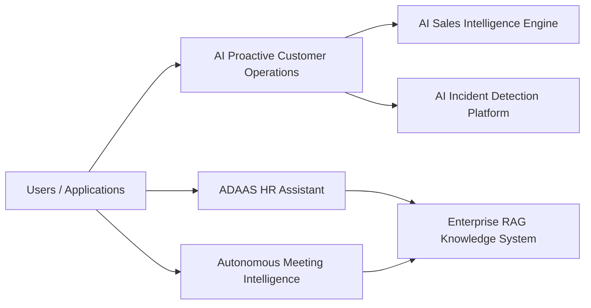

# AI Engineering Portfolio

Production-style AI systems portfolio covering retrieval, multi-agent workflows,
predictive scoring, anomaly detection, meeting intelligence, and an HR assistant
application.

This repository is an index and review guide for the six runnable projects. It
is not a seventh standalone application.

## Static Landing Site

Open [`index.html`](index.html) for a portfolio-facing landing page designed for
GitHub Pages. It summarizes the six runnable projects, links to each repo and
demo guide, and gives 3-minute, 15-minute, and 30-minute reviewer paths.

GitHub Pages setup:

1. Open this repository on GitHub.
2. Go to Settings > Pages.
3. Set source to "GitHub Actions".
4. Save the setting.
5. Push to `main` or run the `Deploy GitHub Pages` workflow manually.
6. Open the generated Pages URL after deployment finishes.

Manual repository setup is required once: GitHub Pages must be enabled in the
repository settings and configured to use GitHub Actions as the source. The
workflow does not require secrets or credentials.

## System Map



## Portfolio Documentation

- [Architecture diagrams](docs/ARCHITECTURE.md)
- [API flow diagrams](docs/API_FLOWS.md)
- [Demo capture guide](docs/DEMO_CAPTURE.md)
- [Project comparison table](docs/PROJECT_COMPARISON.md)
- [Recruiter and interviewer walkthrough](docs/WALKTHROUGH.md)
- [Technical tradeoff notes](docs/TRADEOFFS.md)

## Project Status

| Project | Role | Current runnable surface | Verification |
|---|---|---|---|
| `enterprise-rag-knowledge-system` | Retrieval and grounded answer pipeline | FastAPI `/query`, `/metrics`, SQLite event store, Compose/K8s config | Locally tested, smoke-tested, Docker/K8s config statically validated, Docker image build validated in CI |
| `ai-proactive-customer-operations` | Multi-agent customer decision workflow | FastAPI `/decide`, `/metrics`, SQLite event store, Compose/K8s config | Locally tested, smoke-tested, Docker/K8s config statically validated, Docker image build validated in CI |
| `ai-incident-detection-platform` | Operational anomaly scoring | FastAPI `/score`, `/metrics`, SQLite event store, Compose/K8s config | Locally tested, smoke-tested, Docker/K8s config statically validated, Docker image build validated in CI |
| `ai-sales-intelligence-engine` | Account propensity scoring | FastAPI `/score`, `/metrics`, SQLite event store, Compose/K8s config | Locally tested, smoke-tested, Docker/K8s config statically validated, Docker image build validated in CI |
| `autonomous-meeting-intelligence` | Transcript structuring | FastAPI `/analyze`, `/metrics`, SQLite event store, Compose/K8s config | Locally tested, smoke-tested, Docker/K8s config statically validated, Docker image build validated in CI |
| `ADAAS` | Flutter HR assistant and Node HR backend | Flutter app, secured backend, Mongo persistence, Compose/K8s config | Locally tested, smoke-tested, Docker/K8s config statically validated, Docker image build validated in CI |

GitHub Actions validates service image builds on push and pull requests without
pushing images to a registry. Cluster deployment is still pending
environment-backed cloud verification for all six runnable projects.

## Runbook

Python service pattern:

```bash
cd <project>
python -m pytest -q
python evaluation/evaluate.py
uvicorn api.server:app --reload --port 8000
```

With the server running, use a second terminal:

```bash
python scripts/smoke_test.py
```

Enterprise RAG uses a named eval runner:

```bash
cd enterprise-rag-knowledge-system
python evaluation/run_eval.py
```

ADAAS:

```bash
cd ADAAS/hr-backend
npm test
npm start
npm run smoke

cd ..
flutter test
flutter analyze
flutter run -d chrome \
  --dart-define=HR_API_BASE_URL=http://localhost:3000 \
  --dart-define=HR_API_KEY=change-me
```

## Portfolio Readiness Checklist

For demo paths and sample assets, see `DEMO.md`.

| Project | README | API docs | Env example | Tests and eval | Docker/Compose | Kubernetes | CI |
|---|---|---|---|---|---|---|---|
| [`enterprise-rag-knowledge-system`](https://github.com/Adityansh-Chand/enterprise-rag-knowledge-system) | Yes | Yes | Yes | Yes | Yes | Yes | Yes |
| [`ai-proactive-customer-operations`](https://github.com/Adityansh-Chand/ai-proactive-customer-operations) | Yes | Yes | Yes | Yes | Yes | Yes | Yes |
| [`ai-incident-detection-platform`](https://github.com/Adityansh-Chand/ai-incident-detection-platform) | Yes | Yes | Yes | Yes | Yes | Yes | Yes |
| [`ai-sales-intelligence-engine`](https://github.com/Adityansh-Chand/ai-sales-intelligence-engine) | Yes | Yes | Yes | Yes | Yes | Yes | Yes |
| [`autonomous-meeting-intelligence`](https://github.com/Adityansh-Chand/autonomous-meeting-intelligence) | Yes | Yes | Yes | Yes | Yes | Yes | Yes |
| [`ADAAS`](https://github.com/Adityansh-Chand/ADAAS) | Yes | Yes | Yes | Yes | Yes | Yes | Yes |

## Final Reviewer Checklist

- Start at `index.html` or the GitHub Pages site for the 3-minute overview.
- Use `DEMO.md` to pick one runnable service and follow its exact smoke path.
- Open each target repo README for purpose, quickstart, API surface, deployment status, and remaining gaps.
- Inspect `docs/ARCHITECTURE.md`, `docs/API_FLOWS.md`, and `docs/TRADEOFFS.md` for system-level reasoning.
- Treat this repository as the portfolio index only; the six linked repos are the runnable projects.
- Expect local demos, tests/evals, static deployment config validation, and CI Docker image builds; cloud deployment and production data remain pending.

## 5-Minute Review Path

1. Open `DEMO.md` and choose one service from the demo matrix.
2. For the fastest API review, start `enterprise-rag-knowledge-system`:

```bash
cd enterprise-rag-knowledge-system
pip install -r requirements.txt
python -m pytest -q
uvicorn api.server:app --reload --port 8000
```

3. In a second terminal, run:

```bash
python scripts/smoke_test.py
```

4. Inspect `examples/requests/query.json` and `examples/responses/query.json`.
5. Repeat the same pattern for any scoring, orchestration, transcript, or HR assistant repo of interest.

## Maturity Matrix

| Project | Status Labels |
|---|---|
| `enterprise-rag-knowledge-system` | locally tested, smoke-tested, Docker config statically validated, Docker image build validated in CI, cloud deployment pending, needs production data |
| `ai-proactive-customer-operations` | locally tested, smoke-tested, Docker config statically validated, Docker image build validated in CI, cloud deployment pending, needs production data |
| `ai-incident-detection-platform` | locally tested, smoke-tested, Docker config statically validated, Docker image build validated in CI, cloud deployment pending, needs production data |
| `ai-sales-intelligence-engine` | locally tested, smoke-tested, Docker config statically validated, Docker image build validated in CI, cloud deployment pending, needs production data |
| `autonomous-meeting-intelligence` | locally tested, smoke-tested, Docker config statically validated, Docker image build validated in CI, cloud deployment pending, needs production data |
| `ADAAS` | locally tested, smoke-tested, Docker config statically validated, Docker image build validated in CI, cloud deployment pending, needs production data |

## Projects

## 1. enterprise-rag-knowledge-system

Core retrieval reasoning backbone using semantic chunking, reranking, and confidence scoring.
https://github.com/Adityansh-Chand/enterprise-rag-knowledge-system.git

## 2. ai-proactive-customer-operations

Explicit multi-agent DAG orchestration implementing planner to specialist to action workflow.
https://github.com/Adityansh-Chand/ai-proactive-customer-operations.git

## 3. ADAAS

Production HR assistant integrating RAG reasoning with real-time API data.
https://github.com/Adityansh-Chand/ADAAS.git

## 4. ai-sales-intelligence-engine

Predictive ML pipeline for customer intelligence scoring.
https://github.com/Adityansh-Chand/ai-sales-intelligence-engine.git

## 5. ai-incident-detection-platform

Anomaly detection system for operational intelligence.
https://github.com/Adityansh-Chand/ai-incident-detection-platform.git

## 6. autonomous-meeting-intelligence

Structured transcript understanding pipeline for summaries, decisions, and action items.
https://github.com/Adityansh-Chand/autonomous-meeting-intelligence.git

## Shared Engineering Themes

- Typed request/response boundaries for APIs.
- Domain-specific sample data instead of generic demo CSVs.
- Focused tests that assert real system behavior.
- Lightweight evaluation scripts with explicit accuracy or structure metrics.
- Docker entrypoints that run FastAPI services through `uvicorn`.
- Deterministic local fallbacks where external providers are optional.
- Optional `X-API-Key` auth on non-health data endpoints.
- Request IDs, safe error responses, and JSON metrics endpoints.
- SQLite event persistence for Python services; MongoDB persistence for ADAAS.
- GitHub Actions CI across tests, evals, and container builds.

## Remaining Portfolio-Level Improvements

- Capture and link final screenshots or short recordings per system.
- Add a shared API contract document for common request tracing.
- Add common logging and metric naming conventions.
- Add managed cloud deployment targets and release environments.

## Author

Adityansh Chand

AI Software Engineer specializing in multi-agent systems, retrieval engineering,
LLM architecture, and machine learning pipelines.
