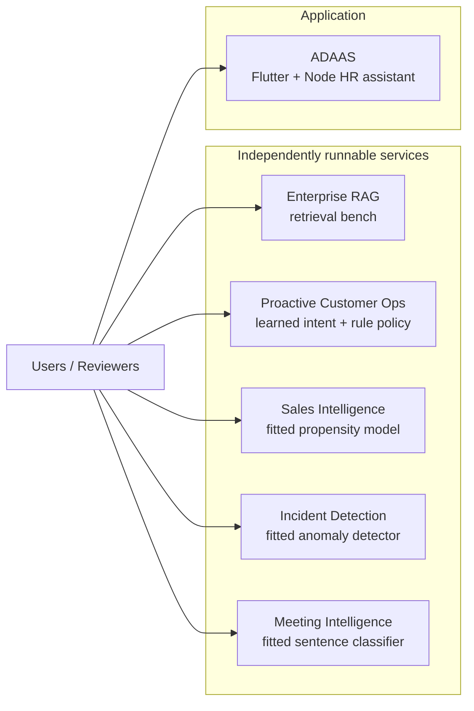

# AI Engineering Portfolio

Production-style AI systems portfolio covering retrieval, multi-agent workflows,
predictive scoring, anomaly detection, meeting intelligence, and an HR assistant
application.

This repository is an index and review guide for the six runnable projects. It
is not a seventh standalone application.

## Static Landing Site

Open [`index.html`](index.html) for a portfolio-facing landing page designed for
GitHub Pages. It summarizes the six runnable projects, links to each repo and
demo guide, and gives 3-minute, 15-minute, and 30-minute reviewer paths.

Live site: <https://adityansh-chand.github.io/ai-engineering-portfolio/>

GitHub Pages setup:

1. Open this repository on GitHub.
2. Go to Settings > Pages.
3. Set source to "GitHub Actions".
4. Save the setting.
5. Push to `main` or run the `Deploy GitHub Pages` workflow manually.
6. Open the generated Pages URL after deployment finishes.

Manual repository setup is required once: GitHub Pages must be enabled in the
repository settings and configured to use GitHub Actions as the source. The
workflow does not require secrets or credentials.

## System Map


```mermaid
flowchart LR
  User[Users / Reviewers]

  subgraph Services[Independently runnable services]
    RAG[Enterprise RAG<br/>retrieval bench]
    OPS[Proactive Customer Ops<br/>learned intent + rule policy]
    SALES[Sales Intelligence<br/>fitted propensity model]
    INCIDENT[Incident Detection<br/>fitted anomaly detector]
    MEETING[Meeting Intelligence<br/>fitted sentence classifier]
  end

  subgraph App[Application]
    ADAAS[ADAAS<br/>Flutter + Node HR assistant]
  end

  User --> RAG
  User --> OPS
  User --> SALES
  User --> INCIDENT
  User --> MEETING
  User --> ADAAS
```

These services are **independent**. They share a common service template for HTTP
hardening, event storage and metrics, but none calls another at runtime.

An earlier version of this diagram showed `OPS --> SALES`, `OPS --> INCIDENT` and
`MEETING --> RAG`. Those calls did not exist in any codebase. The diagram now
shows what is actually there; edges will be added if and when they are built.


## Portfolio Documentation

- [Architecture diagrams](docs/ARCHITECTURE.md)
- [API flow diagrams](docs/API_FLOWS.md)
- [Demo capture guide](docs/DEMO_CAPTURE.md)
- [Project comparison table](docs/PROJECT_COMPARISON.md)
- [Recruiter and interviewer walkthrough](docs/WALKTHROUGH.md)
- [Technical tradeoff notes](docs/TRADEOFFS.md)

## Project Status

Each Python service ships a **fitted model** with metrics measured on a held-out
split. Training data is **synthetic** except where noted, generated by a seeded
script committed alongside the model; CI regenerates the data and retrains to
prove the committed artifacts are reproducible.

| Project | Model | Headline held-out result | Data |
|---|---|---|---|
| [`enterprise-rag-knowledge-system`](https://github.com/Adityansh-Chand/enterprise-rag-knowledge-system) | BM25 / LSA / dense bi-encoder / RRF fusion | **BEIR/NFCorpus nDCG@10: dense 0.3727, bm25 0.2831** (human qrels) | **Real BEIR benchmark** + synthetic demo corpus |
| [`ai-sales-intelligence-engine`](https://github.com/Adityansh-Chand/ai-sales-intelligence-engine) | Logistic regression (fitted) | ROC-AUC **0.8614** against a measured Bayes ceiling of 0.8898 | Synthetic, 5,000 accounts |
| [`ai-incident-detection-platform`](https://github.com/Adityansh-Chand/ai-incident-detection-platform) | IsolationForest on normal traffic | Precision **0.7895**, 17/17 incidents caught, 32% fewer alerts than baseline | Synthetic, 40,320 minutes |
| [`ai-proactive-customer-operations`](https://github.com/Adityansh-Chand/ai-proactive-customer-operations) | 2 × TF-IDF → LogisticRegression + rule policy | Intent macro-F1 **0.6476** on held-out phrasings; sentiment 0.9121 | Synthetic, 2,400 messages |
| [`autonomous-meeting-intelligence`](https://github.com/Adityansh-Chand/autonomous-meeting-intelligence) | TF-IDF → LogisticRegression, 3-class | Macro-F1 **0.5894** vs 0.3235 for the keyword gate it replaced | Synthetic, 3,154 sentences |
| [`ADAAS`](https://github.com/Adityansh-Chand/ADAAS) | Flutter HR assistant and Node HR backend | Flutter app, secured backend, Mongo persistence, Compose/K8s config | Curated 26-entry policy KB |

All six: locally tested, smoke-tested, Docker/K8s config statically validated,
Docker image builds validated in CI. **Cloud deployment is pending and unverified
for all of them.**

### Read the numbers with their design

The metrics above are lower than a portfolio usually advertises, and that is
deliberate. Every one of these evaluations previously reported near-perfect scores
against data written to satisfy the code being tested. What changed is mostly
evaluation design:

- **Held-out templates, not rows** (ops, meeting): a row-level split let the
  classifier memorise phrasings on both sides and score **1.00**. Holding out whole
  phrasings dropped it to 0.6476. That drop is the result.
- **Chronological, not random** (incident): incidents span consecutive minutes, so
  a random split leaks the middle of an episode into training.
- **Report the ceiling** (sales): 0.8614 against a measured Bayes-optimal 0.8898
  means the model captures nearly all the signal that exists.

Results that came out worse than hoped are kept and stated — hybrid retrieval
losing to dense alone, a reranker that improves nothing, a z-score baseline that
beats the fitted detector on PR-AUC, an owner extractor recalling 0.35. See
[`docs/PROJECT_COMPARISON.md`](docs/PROJECT_COMPARISON.md).

### Shared service template

The five Python services deliberately share HTTP hardening (`utils/security.py`),
a SQLite event store (`utils/storage.py`), a metrics surface, and their
Docker/Compose/CI shape. Stated here so a reviewer who diffs those files finds
what they were told they would find. The domain logic and evaluation design are
independent per repository.

## Runbook

Python service pattern:

```bash
cd <project>
python -m pytest -q
python evaluation/evaluate.py
uvicorn api.server:app --reload --port 8000
```

With the server running, use a second terminal:

```bash
python scripts/smoke_test.py
```

Enterprise RAG uses a named eval runner:

```bash
cd enterprise-rag-knowledge-system
python evaluation/run_eval.py
```

ADAAS:

```bash
cd ADAAS/hr-backend
npm test
npm start
npm run smoke

cd ..
flutter test
flutter analyze
flutter run -d chrome \
  --dart-define=HR_API_BASE_URL=http://localhost:3000 \
  --dart-define=HR_API_KEY=change-me
```

## Portfolio Readiness Checklist

For demo paths and sample assets, see `DEMO.md`.

"Model card" and "Reproducible artifacts" are the columns worth checking: the
first means the model's provenance and limitations are written down, the second
means CI regenerates the data and retrains to prove the committed numbers.

| Project | README | Model card | Reproducible artifacts | Tests and eval | Docker/Compose | Kubernetes | CI |
|---|---|---|---|---|---|---|---|
| [`enterprise-rag-knowledge-system`](https://github.com/Adityansh-Chand/enterprise-rag-knowledge-system) | Yes | n/a (no single model) | Yes | Yes | Yes | Yes | Yes |
| [`ai-proactive-customer-operations`](https://github.com/Adityansh-Chand/ai-proactive-customer-operations) | Yes | Yes | Yes | Yes | Yes | Yes | Yes |
| [`ai-incident-detection-platform`](https://github.com/Adityansh-Chand/ai-incident-detection-platform) | Yes | Yes | Yes | Yes | Yes | Yes | Yes |
| [`ai-sales-intelligence-engine`](https://github.com/Adityansh-Chand/ai-sales-intelligence-engine) | Yes | Yes | Yes | Yes | Yes | Yes | Yes |
| [`autonomous-meeting-intelligence`](https://github.com/Adityansh-Chand/autonomous-meeting-intelligence) | Yes | Yes | Yes | Yes | Yes | Yes | Yes |
| [`ADAAS`](https://github.com/Adityansh-Chand/ADAAS) | Yes | n/a | n/a | Yes | Yes | Yes | Yes |

## Final Reviewer Checklist

- Start at `index.html` or the GitHub Pages site for the 3-minute overview.
- Use `DEMO.md` to pick one runnable service and follow its exact smoke path.
- Open each target repo README for purpose, quickstart, API surface, deployment status, and remaining gaps.
- Inspect `docs/ARCHITECTURE.md`, `docs/API_FLOWS.md`, and `docs/TRADEOFFS.md` for system-level reasoning.
- Treat this repository as the portfolio index only; the six linked repos are the runnable projects.
- Expect local demos, tests/evals, static deployment config validation, and CI Docker image builds; cloud deployment and production data remain pending.
- To check a claim rather than take it: run `python training/train.py --verify` in
  any service repo. It retrains from the committed generator and fails if the
  shipped metrics drift. `python training/generate_*.py --check` does the same for
  the datasets.
- Every model's training data is **synthetic** and every README says so at the top.
  The RAG repo additionally reports results on public BEIR benchmarks.

## 5-Minute Review Path

1. Open `DEMO.md` and choose one service from the demo matrix.
2. From the Workspace folder or a clone of the target repo, start
   `enterprise-rag-knowledge-system`:

```bash
cd enterprise-rag-knowledge-system
pip install -r requirements.txt
python -m pytest -q
uvicorn api.server:app --reload --port 8000
```

3. In a second terminal, run:

```bash
python scripts/smoke_test.py
```

4. Inspect `examples/requests/query.json` and `examples/responses/query.json`.
5. Repeat the same pattern for any scoring, orchestration, transcript, or HR assistant repo of interest.

## Maturity Matrix

| Project | Status labels |
|---|---|
| `enterprise-rag-knowledge-system` | fitted retrievers, **real benchmark evaluation**, synthetic demo corpus, reproducible artifacts, locally tested, smoke-tested, Docker config statically validated, image build validated in CI, cloud deployment pending |
| `ai-proactive-customer-operations` | fitted classifiers, synthetic training data, held-out-template evaluation, reproducible artifacts, locally tested, smoke-tested, Docker config statically validated, image build validated in CI, cloud deployment pending |
| `ai-incident-detection-platform` | fitted detector, synthetic training data, chronological evaluation, reproducible artifacts, locally tested, smoke-tested, Docker config statically validated, image build validated in CI, cloud deployment pending |
| `ai-sales-intelligence-engine` | fitted model, synthetic training data, held-out evaluation with reported ceiling, reproducible artifacts, locally tested, smoke-tested, Docker config statically validated, image build validated in CI, cloud deployment pending |
| `autonomous-meeting-intelligence` | fitted classifier, synthetic training data, held-out-template evaluation, measured rule-based slots, reproducible artifacts, locally tested, smoke-tested, Docker config statically validated, image build validated in CI, cloud deployment pending |
| `ADAAS` | locally tested, smoke-tested, Docker config statically validated, Docker image build validated in CI, cloud deployment pending, needs production data |

`synthetic training data` means the model is fitted on generated data from a
seeded, documented generator. The metrics are real measurements on held-out
splits; they are **not** evidence of real-world performance.

## Projects

## 1. enterprise-rag-knowledge-system

A retrieval bench: BM25, LSA, a dense bi-encoder and rank fusion behind one
interface, evaluated on real BEIR benchmarks with a per-query-type breakdown
showing where each method wins and loses.
https://github.com/Adityansh-Chand/enterprise-rag-knowledge-system.git

## 2. ai-proactive-customer-operations

Multi-agent DAG with learned intent and sentiment classification in front of a
deterministic, auditable policy layer. Every decision names the rule that fired.
https://github.com/Adityansh-Chand/ai-proactive-customer-operations.git

## 3. ADAAS

Production HR assistant integrating RAG reasoning with real-time API data.
https://github.com/Adityansh-Chand/ADAAS.git

## 4. ai-sales-intelligence-engine

Fitted logistic regression for account propensity, with attribution that provably
reconstructs the model's own log-odds and a reported Bayes ceiling.
https://github.com/Adityansh-Chand/ai-sales-intelligence-engine.git

## 5. ai-incident-detection-platform

Time-series anomaly detection fitted on normal traffic, evaluated chronologically
with rare-event metrics and a threshold calibrated to an operational precision target.
https://github.com/Adityansh-Chand/ai-incident-detection-platform.git

## 6. autonomous-meeting-intelligence

Fitted sentence classifier extracting decisions and action items, beating the
keyword gate it replaced by a measured margin on held-out phrasings.
https://github.com/Adityansh-Chand/autonomous-meeting-intelligence.git

## Shared Engineering Themes

- Typed request/response boundaries for APIs.
- Seeded, reproducible data generators whose output is re-verified in CI.
- Focused tests that assert real system behavior.
- Evaluations designed so they can fail: held-out splits, task-appropriate metrics,
  and baselines scored on the same data.
- Docker entrypoints that run FastAPI services through `uvicorn`.
- Deterministic local fallbacks where external providers are optional.
- Optional `X-API-Key` auth on non-health data endpoints.
- Request IDs, safe error responses, and JSON metrics endpoints.
- SQLite event persistence for Python services; MongoDB persistence for ADAAS.
- GitHub Actions CI across tests, evals, and container builds.

## Remaining Portfolio-Level Improvements

- Validate on real (non-synthetic) data for at least one service. This is the
  single largest gap: every model here is fitted on generated data.
- Cloud deployment with a live managed environment; currently only static config
  validation and CI image builds exist.
- Weighted rank fusion in the RAG repo — unweighted RRF currently underperforms
  its own best component.
- A cross-encoder reranker to compare against the fitted pairwise reranker, which
  measured no improvement.
- Improve owner extraction in the meeting service (recall 0.3484 — misses full
  names, titles and team references).
- Drift detection and retraining triggers; no service monitors its live score
  distribution.
- Capture and link final screenshots or short recordings per system.

## Author

Adityansh Chand

AI Software Engineer specializing in multi-agent systems, retrieval engineering,
LLM architecture, and machine learning pipelines.
