# AI Engineering Portfolio

Production-style AI systems portfolio covering retrieval, multi-agent workflows,
predictive scoring, anomaly detection, meeting intelligence, and an HR assistant
application.

This repository is an index and review guide for five interconnected services. It
is not a seventh standalone application.

## Static Landing Site

Open [`index.html`](index.html) for a portfolio-facing landing page designed for
GitHub Pages. It summarizes the five services, links to each repo and
demo guide, and gives 3-minute, 15-minute, and 30-minute reviewer paths.

Live site: <https://adityansh-chand.github.io/ai-engineering-portfolio/>

GitHub Pages setup:

1. Open this repository on GitHub.
2. Go to Settings > Pages.
3. Set source to "GitHub Actions".
4. Save the setting.
5. Push to `main` or run the `Deploy GitHub Pages` workflow manually.
6. Open the generated Pages URL after deployment finishes.

Manual repository setup is required once: GitHub Pages must be enabled in the
repository settings and configured to use GitHub Actions as the source. The
workflow does not require secrets or credentials.

## System Map

The five Python services run **independently** and also compose into one system.
Every edge below is optional: unset its environment variable and that service
goes back to running exactly as it does alone.

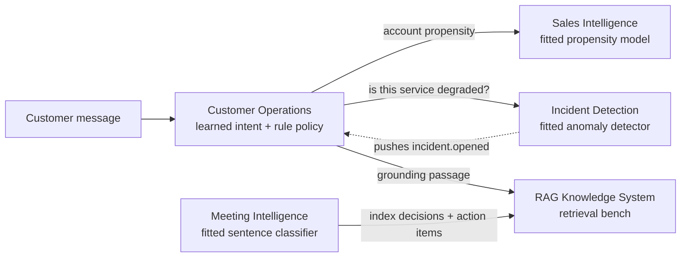
```mermaid
flowchart LR
  User[Customer message]
  Meeting[Meeting Intelligence<br/>fitted sentence classifier]
  Ops[Customer Operations<br/>learned intent + rule policy]
  Sales[Sales Intelligence<br/>fitted propensity model]
  Incident[Incident Detection<br/>fitted anomaly detector]
  RAG[RAG Knowledge System<br/>retrieval bench]

  User --> Ops
  Ops -->|account propensity| Sales
  Ops -->|is this service degraded?| Incident
  Ops -->|grounding passage| RAG
  Meeting -->|index decisions + action items| RAG
  Incident -.->|pushes incident.opened| Ops
```

Four **pull** edges and one **push** edge. The dotted line is what makes
"proactive" literally true: when a service becomes degraded, the incident
platform pushes an event and operations reaches out to customers who recently
complained about that service -- without anyone asking.

| Edge | What it changes |
|---|---|
| `ops → sales` | A high-propensity account writing in unhappy escalates for retention |
| `ops → incident` | A complaint about a service that is **currently degraded** becomes an incident response, not an individual refund |
| `ops → rag` | The reply is grounded in a retrieved policy or runbook passage |
| `meeting → rag` | *"What did we decide about the migration plan?"* becomes answerable |
| `incident ⇢ ops` | **Push.** A service becoming degraded triggers unprompted outreach to affected customers |

**The constraint the integration was built under: an enrichment may improve a
decision, but it may never prevent one.** Every call has a short timeout, one
bounded retry, and a circuit breaker; failures are recorded in the decision trace
and the decision is made anyway. `tests/test_integration.py` in the operations
and meeting repos asserts the degraded path against a real HTTP server, not a mock.

### The push edge, and what push costs

Detection cannot block on delivery, so events go to an outbox and a background
worker delivers them with exponential backoff. Delivery is therefore
**at-least-once, not exactly-once** -- a delivery that succeeds and whose
acknowledgement is lost is indistinguishable from one that failed, so claiming
exactly-once would be a lie. The consequence is that **subscribers must be
idempotent**: operations deduplicates by `event_id`, and a test asserts a
redelivery does not message the same customers twice.

Events that exhaust their retries land in a dead-letter queue at
`GET /events/dlq` rather than vanishing. An event bus whose failures disappear is
worse than none, because it looks like it is working.

This is a webhook fan-out with the failure handling that makes push usable. It is
**not a broker** -- no durable log, no partitioning, no consumer groups, and the
outbox is lost on restart. The README of the incident repo says so too.

### Drift detection

Every service compares the distribution it is producing now against a reference
captured at training time, and reports a status at `/v1/drift`.

| Service | Signal | In-distribution | Shifted |
|---|---|---|---|
| incident | anomaly score | stable, PSI 0.0434 | significant, PSI 11.3 |
| operations | predicted intent mix | stable, PSI 0.0235 | significant, PSI 11.0 |
| meeting | sentence class mix | stable, PSI 0.005 | significant, PSI 1.04 |
| retrieval | top retrieval score | stable, PSI 0.0 | significant, PSI 1.37 |
| sales | propensity score | — | flagged on skewed input |

**Both directions are measured.** A monitor that only ever fires is not evidence
of anything, and one that cries wolf teaches whoever reads it to ignore the
signal — so the tests assert quiet on in-distribution data as well as loud on
shifted data.

Classifier confidence was the first signal tried and it failed exactly that way:
on a template-generated corpus confidence is bimodal, so it reported significant
drift on ordinary traffic. The classifier services monitor **predicted class mix**
instead.

The case for this existing is in the incident service's real-data track:
configured for a 3% alert budget, that detector fires on 21%, 6% and 52% of points
across three real machines, purely because the test period is not the training
period.

### Following one request across five services

Every service records the request id alongside each event, and `/v1/events`
accepts a `request_id` filter. `scripts/trace.py` asks all five the same question
and merges the answers into one ordered timeline:

```bash
python scripts/trace.py demo-1a2b3c4d
```

```
 1. 2026-08-31 06:43:21  incident  incident_lookup      service=checkout
 2. 2026-08-31 06:43:21  ops       customer_decision    policy=refund_review
 3. 2026-08-31 06:43:21  rag       rag_query            groundedness=1.0
 4. 2026-08-31 06:43:21  sales     sales_account_lookup segment=medium_propensity
```

The id already crossed service boundaries; what was missing was storing it next
to the event, so there was something to join on. A service that cannot be reached
is **named in the output** rather than omitted — an incomplete trace that looks
complete is worse than no trace.

This is a script, not a tracing backend, deliberately. At five services on one
host, OpenTelemetry and a collector would be more operational surface than the
problem justifies; the missing piece was the join, not the infrastructure.

### Contract checks

Five services and five edges means a provider can change a response field, keep
its own tests green because nothing in that repo reads it, and break its consumer
at runtime. That is the most likely way this system rots.

[`contracts/contracts.json`](contracts/contracts.json) records what each consumer
**actually reads** from each provider. Fields not listed are not depended on and
may change freely -- which is the useful half of writing them down.

```bash
python scripts/verify_contracts.py --local
```

It starts the services, calls each provider, and checks the shapes. I verified it
fails correctly by injecting a field the provider does not return.

Contracts target **versioned** paths (`/v1/...`). Providers still serve the bare
paths as a deprecated alias, so a contract written against one would pass today
and break the day that alias is removed — `scripts/check_contracts_wellformed.py`
rejects unversioned contract paths for exactly that reason.

Run the whole thing:

```bash
docker compose up --build
python scripts/demo_end_to_end.py
```

Or without Docker:

```bash
python scripts/demo_end_to_end.py --local
```

The demo opens an incident, records a meeting decision and retrieves it back,
shows the same complaint producing **different decisions** depending on whether
the service is degraded, then kills a dependency to show the system degrade
instead of fail. One request id flows through every hop.

Both commands run against an **authenticated** stack. `portfolio-demo-key` is the
committed default -- a demo key, not a secret, chosen so a fresh clone exercises
the auth path rather than leaving it switched off. Override it for anything real,
and the scripts will follow:

```bash
PORTFOLIO_API_KEY=$(openssl rand -hex 24) docker compose up --build
```

## Captured evidence

Everything below is produced by `scripts/capture_assets.py` from real runs.
Nothing is typed by hand — an asset that can be hand-edited is not evidence.

### One scenario through all five services

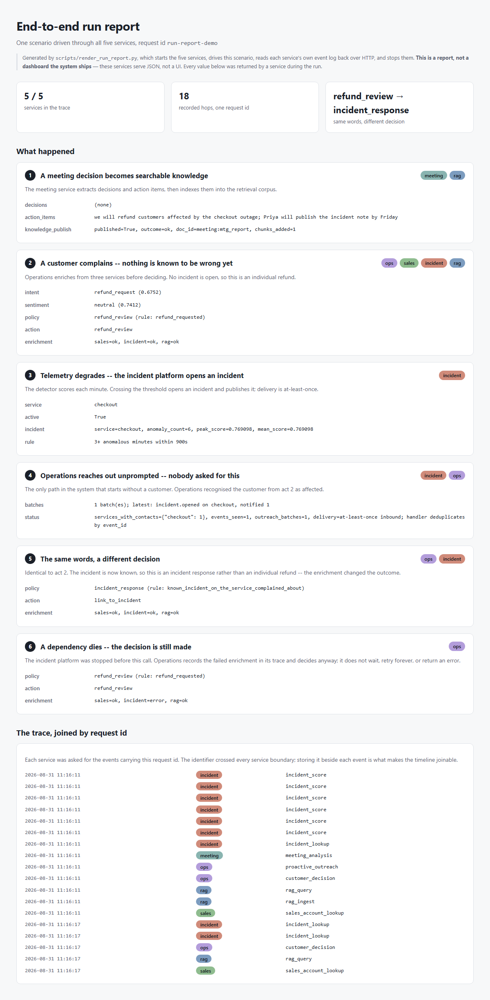

The whole system in one image: a meeting decision indexed into retrieval, a
complaint enriched from three services, telemetry degrading until an incident
opens and is **pushed** to operations, unprompted outreach to the customer who
complained earlier, **the same words producing a different decision** because the
incident is now known, and finally a dependency killed mid-run — the decision is
still made, with `incident=error` recorded in the trace.

Below it, all 18 hops joined by one request id across all five services.

Generated by `scripts/render_run_report.py`, which starts the services, drives the
scenario, reads each service's own event log back over HTTP, and stops them. The
page itself is kept at [`docs/assets/run-report.html`](docs/assets/run-report.html)
so it can be opened and read rather than only viewed as an image. **It
is a report, not a dashboard the system ships** — these services serve JSON, not a
UI. Every value shown was returned by a service during that run.

One thing it shows that flatters nothing: in act 1 the meeting classifier labels
*"Decision: we will refund customers affected by the checkout outage"* as an
action item rather than a decision, so `decisions` reads `(none)`. That is the
0.5441 macro-F1 being visible rather than described.

### The five services, live

The landing site is one click away and needs no help. **These do**: seeing that
five services actually expose the endpoints claimed for them otherwise means
cloning five repositories, installing their dependencies and starting each one.

Each service below was started for real, screenshotted, and stopped. Nothing is
mocked, and the versioned routes, drift endpoints and event surfaces are the ones
the code serves.

| Service | API surface |
|---|---|
| ai-sales-intelligence-engine | 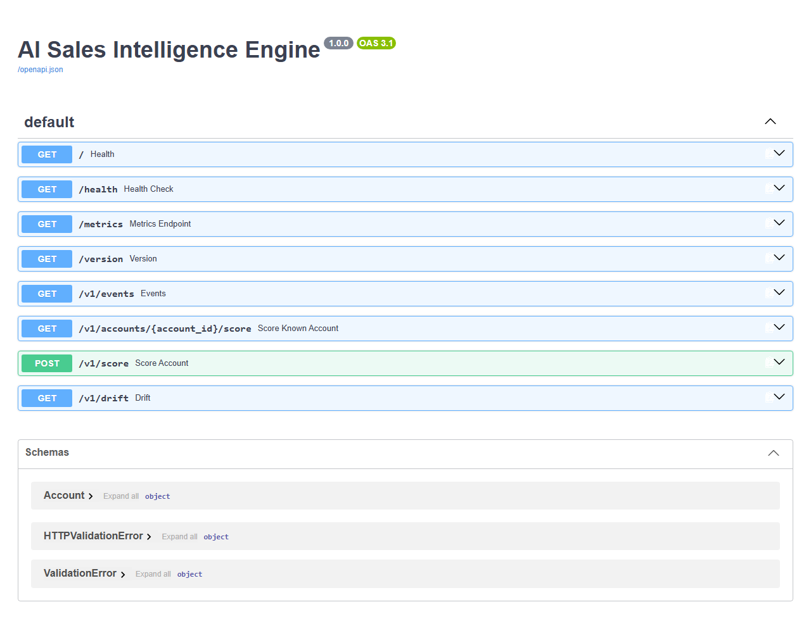 |
| enterprise-rag-knowledge-system | 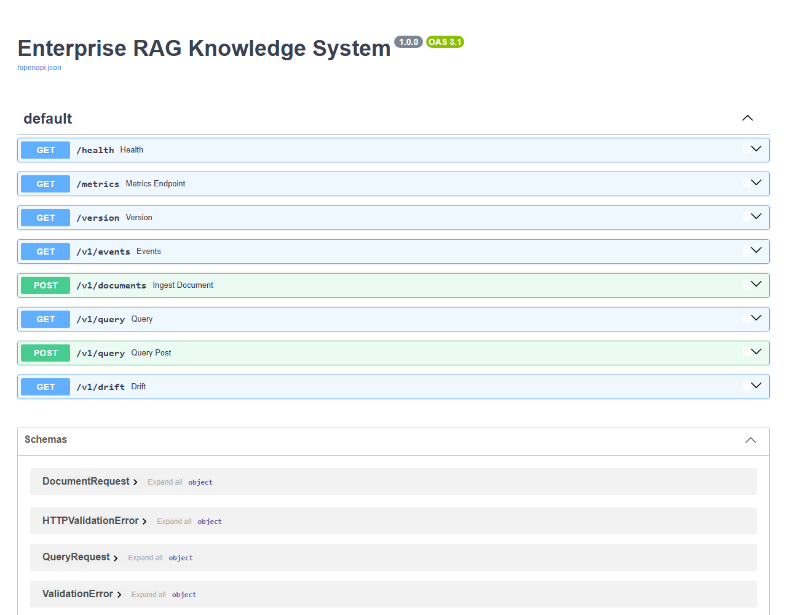 |
| ai-incident-detection-platform | 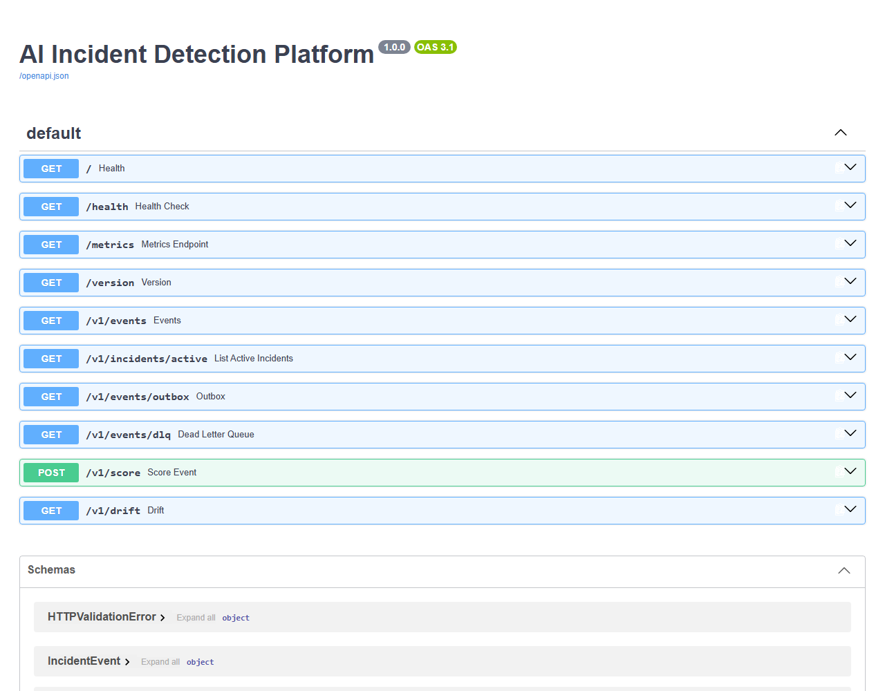 |
| ai-proactive-customer-operations | 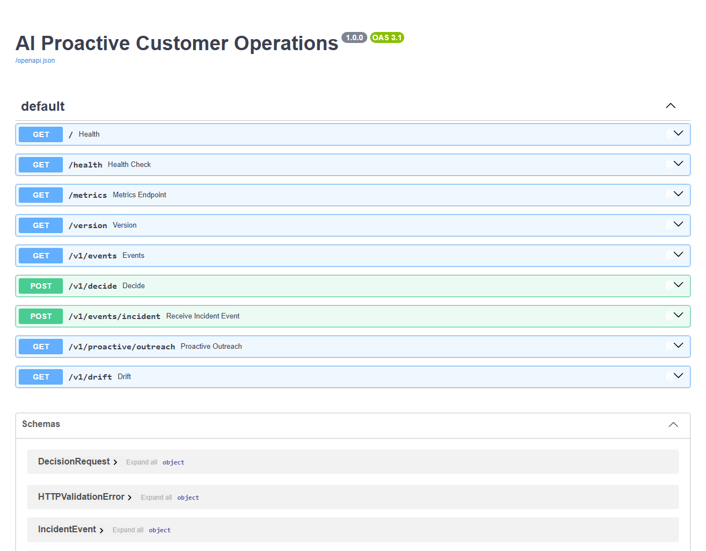 |
| autonomous-meeting-intelligence | 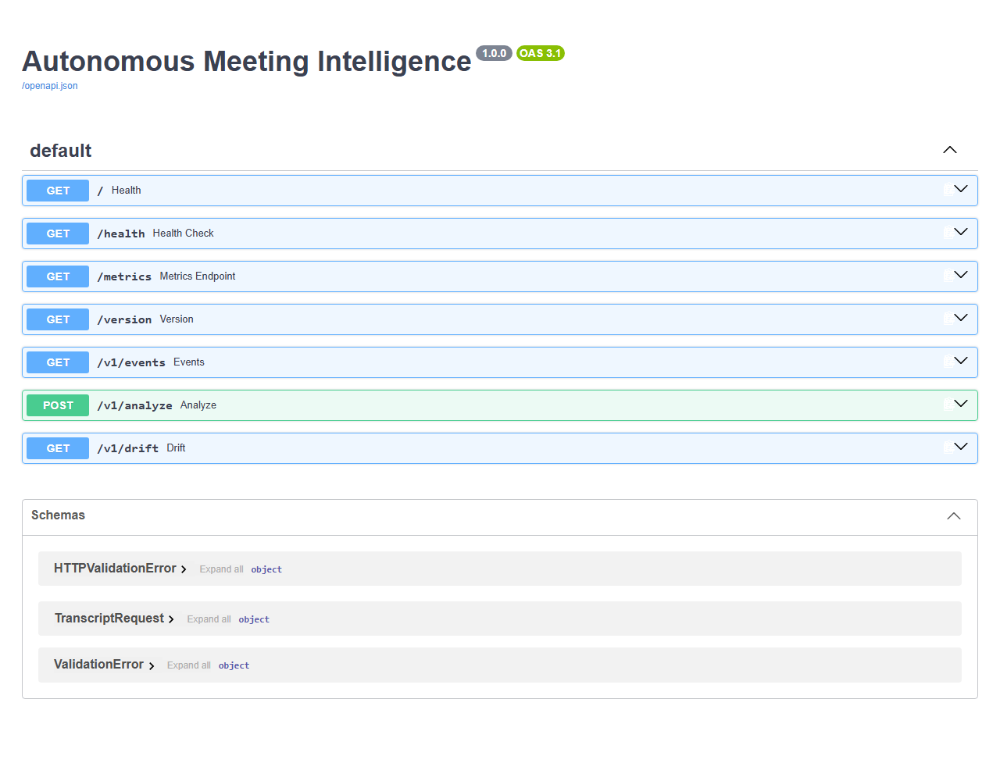 |

### The landing site

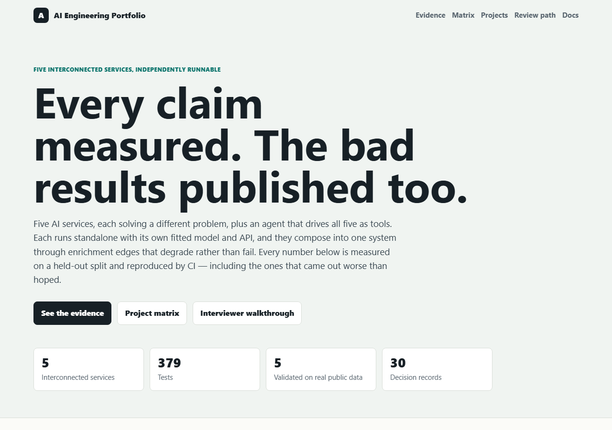

A screenshot, because here the layout *is* the thing being shown. The command
output below is the opposite case, and gets SVG.

### Consumer-driven contracts, verified against live services

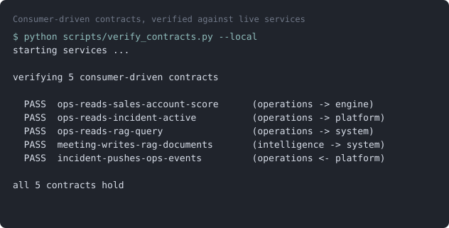

### Retrieval on BEIR/NFCorpus, human relevance judgments

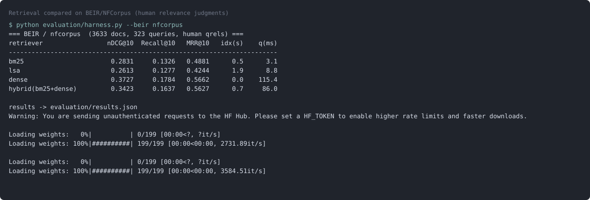

### Anomaly detection on real telemetry — the fitted model loses

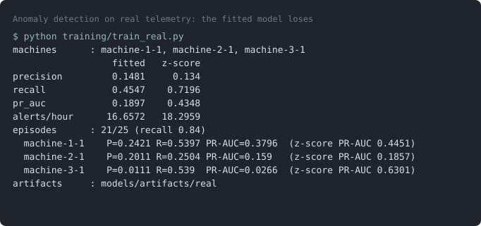

### Evaluation design worth more than the leaky feature

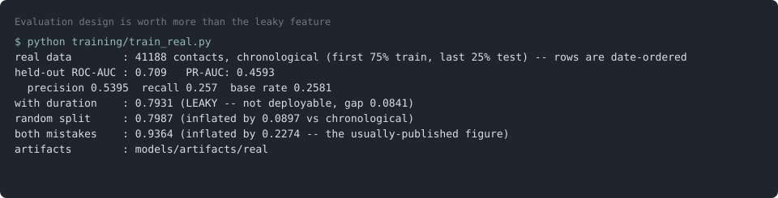

### Concurrency, and a dependency killed mid-run

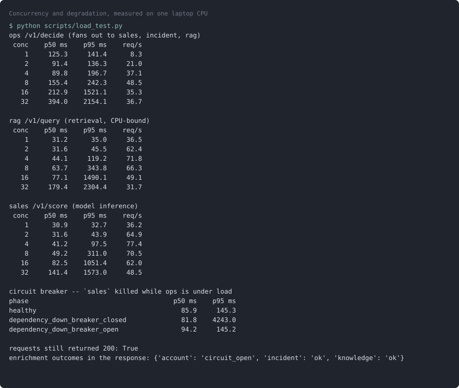

Throughput on both CPU-bound endpoints **peaks at concurrency 4 and then falls** — past the
peak, extra load costs throughput rather than queueing for it. And the median is blind to
it: at concurrency 16 retrieval's p50 is 77 ms, a figure that would pass any dashboard,
while its p95 is 1490 ms.

The bottom block is the circuit breaker earning its place. With `sales` killed and the
breaker still closed, p95 is **4243 ms** — every request pays a connection failure plus a
retry before falling back. Once the breaker opens, p95 is **145.2 ms**, against 145.3 ms
healthy. Every request returned 200 throughout, and the response body says
`account: circuit_open` so a reader can tell the enrichment was skipped rather than absent.
Full write-up: [`docs/LOAD_TEST.md`](docs/LOAD_TEST.md).

### What it would cost to run

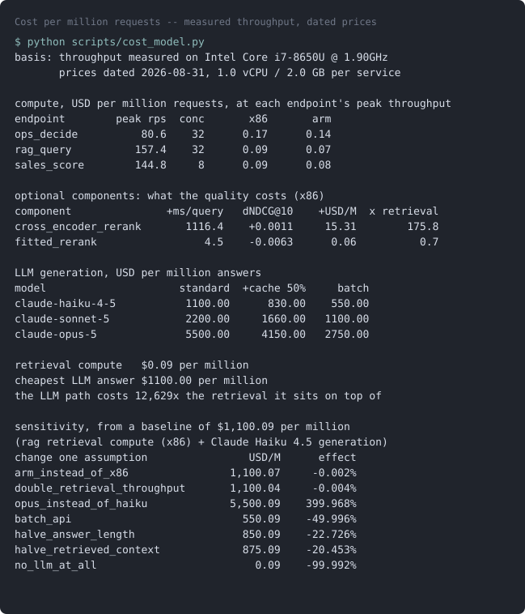

Cost per million requests, derived from the throughput measured above and from dated prices
that cite their sources. Serving a million retrieval queries costs about **19 cents** of
compute; the cheapest LLM answer on top of it costs **$1,100** — the generation step is
**5,759×** everything underneath it.

That number reorders the priorities the load test suggests: doubling retrieval throughput
changes the bill by 0.009%, and changing model tier changes it by 400%. Neither measurement
says that on its own. Full write-up: [`docs/COST_MODEL.md`](docs/COST_MODEL.md).

```bash
python scripts/capture_assets.py
python scripts/load_test.py
python scripts/cost_model.py
```

**Why SVG for terminal output, PNG for the page.** An SVG is text, so it diffs in
review and a reader can see the output was not edited; it regenerates from the
commands, so it cannot drift from what the code prints — a stale GIF is
indistinguishable from a current one; and it is a few KB rather than a few MB. A
rendered page is the opposite: the pixels are the evidence, so it gets a real
screenshot.

**No phone-width capture, on purpose.** One was produced and discarded: headless
Chrome's `--window-size` does not apply mobile viewport emulation, so it lays the
page out at desktop width and crops, making a working site look broken. Driven
through a real browser at 375px the page reports no horizontal overflow, and the
only elements past the viewport are table cells inside their `overflow-x: auto`
container. Publishing the misleading image would have been worse than publishing
none.

Volatile values — request ids, timestamps, absolute paths — are normalised, so a
capture changes only when the *output* changes.

## Portfolio Documentation

- [**Architecture decision records**](docs/adr/) — the eight contested choices, each with
  the alternatives that were rejected and what would make it worth revisiting
- [**Load and degradation**](docs/LOAD_TEST.md) — measured concurrency, and what the
  circuit breaker does when a dependency is killed mid-run
- [**Cost model**](docs/COST_MODEL.md) — cost per million requests from measured throughput
  and dated prices
- [Architecture diagrams](docs/ARCHITECTURE.md)
- [API flow diagrams](docs/API_FLOWS.md)
- [Demo capture guide](docs/DEMO_CAPTURE.md)
- [Project comparison table](docs/PROJECT_COMPARISON.md)
- [Recruiter and interviewer walkthrough](docs/WALKTHROUGH.md)
- [Technical tradeoff notes](docs/TRADEOFFS.md)

## Project Status

Each Python service ships a **fitted model** with metrics measured on a held-out
split. Training data is **synthetic** except where noted, generated by a seeded
script committed alongside the model; CI regenerates the data and retrains to
prove the committed artifacts are reproducible.

| Project | Model | Headline held-out result | Data |
|---|---|---|---|
| [`enterprise-rag-knowledge-system`](https://github.com/Adityansh-Chand/enterprise-rag-knowledge-system) | BM25 / LSA / dense bi-encoder / RRF fusion | **BEIR/NFCorpus nDCG@10: dense 0.3727, bm25 0.2831** (human qrels) | **Real BEIR benchmark** + synthetic demo corpus |
| [`ai-sales-intelligence-engine`](https://github.com/Adityansh-Chand/ai-sales-intelligence-engine) | Logistic regression (fitted) | ROC-AUC **0.8614** against a measured Bayes ceiling of 0.8898 | Synthetic, 5,000 accounts |
| [`ai-incident-detection-platform`](https://github.com/Adityansh-Chand/ai-incident-detection-platform) | IsolationForest on normal traffic | Precision **0.7895**, 17/17 incidents caught, 32% fewer alerts than baseline | Synthetic, 40,320 minutes |
| [`ai-proactive-customer-operations`](https://github.com/Adityansh-Chand/ai-proactive-customer-operations) | 2 × TF-IDF → LogisticRegression + rule policy | Intent macro-F1 **0.6476** on held-out phrasings; sentiment 0.9121 | Synthetic, 2,400 messages |
| [`autonomous-meeting-intelligence`](https://github.com/Adityansh-Chand/autonomous-meeting-intelligence) | TF-IDF → LogisticRegression, 3-class | Macro-F1 **0.5894** vs 0.3235 for the keyword gate it replaced | Synthetic, 3,154 sentences |

All five: locally tested, smoke-tested, Docker/K8s config statically validated,
Docker image builds validated in CI. **Cloud deployment is pending and unverified
for all of them.**

### Read the numbers with their design

The metrics above are lower than a portfolio usually advertises, and that is
deliberate. Every one of these evaluations previously reported near-perfect scores
against data written to satisfy the code being tested. What changed is mostly
evaluation design:

- **Held-out templates, not rows** (ops, meeting): a row-level split let the
  classifier memorise phrasings on both sides and score **1.00**. Holding out whole
  phrasings dropped it to 0.6476. That drop is the result.
- **Chronological, not random** (incident): incidents span consecutive minutes, so
  a random split leaks the middle of an episode into training.
- **Report the ceiling** (sales): 0.8614 against a measured Bayes-optimal 0.8898
  means the model captures nearly all the signal that exists.

Results that came out worse than hoped are kept and stated — hybrid retrieval
losing to dense alone, a reranker that improves nothing, a z-score baseline that
beats the fitted detector on PR-AUC, an owner extractor recalling 0.35. See
[`docs/PROJECT_COMPARISON.md`](docs/PROJECT_COMPARISON.md).

### Validation on real data

Every service is also evaluated on **real, public, human-labelled data**, not only
on its own generated corpus. Where the two disagree, the real number is the one to
believe.

| Service | Real dataset | Result |
|---|---|---|
| retrieval | BEIR / NFCorpus (human qrels) | dense nDCG@10 **0.3727** vs BM25 0.2831 |
| operations | BANKING77, 13k real customer messages | intent macro-F1 **0.9164** across 77 intents |
| sales | UCI Bank Marketing, 41k real campaign outcomes | ROC-AUC **0.7090** chronological |
| incident | Server Machine Dataset, operator-labelled | **loses to a z-score baseline**, 0.1897 vs 0.4348 PR-AUC |
| meeting | AMI Meeting Corpus, 137 recorded meetings | positive-class macro-F1 **0.1799** |

Three of the five score **worse** on real data than on synthetic, one of them
dramatically. That gap is the most useful thing this portfolio measures: the
synthetic numbers were never wrong, they were measuring easier problems, and these
say by how much.

Two findings worth reading in full:

- **Sales** — the same model scores 0.7090 or 0.9364 depending only on whether the
  split is chronological and whether a leaky feature is dropped. Evaluation design
  is worth **0.2274** here, more than the leaky feature itself.
- **Incident** — the fitted IsolationForest loses to three lines of arithmetic on
  every machine tested, against every trivial statistic tried. On synthetic data
  the two are indistinguishable. Published rather than tuned away, with a test
  asserting the finding still holds.

Datasets are fetched by script, checksummed and never committed; CI reproduces
each track.

### Shared service template

The five Python services deliberately share HTTP hardening (`utils/security.py`),
a SQLite event store (`utils/storage.py`), a metrics surface, and their
Docker/Compose/CI shape. Stated here so a reviewer who diffs those files finds
what they were told they would find. The domain logic and evaluation design are
independent per repository.

## Runbook

Python service pattern:

```bash
cd <project>
python -m pytest -q
python evaluation/evaluate.py
uvicorn api.server:app --reload --port 8000
```

With the server running, use a second terminal:

```bash
python scripts/smoke_test.py
```

Enterprise RAG uses a named eval runner:

```bash
cd enterprise-rag-knowledge-system
python evaluation/run_eval.py
```

## Portfolio Readiness Checklist

For demo paths and sample assets, see `DEMO.md`.

"Model card" and "Reproducible artifacts" are the columns worth checking: the
first means the model's provenance and limitations are written down, the second
means CI regenerates the data and retrains to prove the committed numbers.

| Project | README | Model card | Reproducible artifacts | Tests and eval | Docker/Compose | Kubernetes | CI |
|---|---|---|---|---|---|---|---|
| [`enterprise-rag-knowledge-system`](https://github.com/Adityansh-Chand/enterprise-rag-knowledge-system) | Yes | n/a (no single model) | Yes | Yes | Yes | Yes | Yes |
| [`ai-proactive-customer-operations`](https://github.com/Adityansh-Chand/ai-proactive-customer-operations) | Yes | Yes | Yes | Yes | Yes | Yes | Yes |
| [`ai-incident-detection-platform`](https://github.com/Adityansh-Chand/ai-incident-detection-platform) | Yes | Yes | Yes | Yes | Yes | Yes | Yes |
| [`ai-sales-intelligence-engine`](https://github.com/Adityansh-Chand/ai-sales-intelligence-engine) | Yes | Yes | Yes | Yes | Yes | Yes | Yes |
| [`autonomous-meeting-intelligence`](https://github.com/Adityansh-Chand/autonomous-meeting-intelligence) | Yes | Yes | Yes | Yes | Yes | Yes | Yes |

## Final Reviewer Checklist

- Start at `index.html` or the GitHub Pages site for the 3-minute overview.
- Use `DEMO.md` to pick one runnable service and follow its exact smoke path.
- Open each target repo README for purpose, quickstart, API surface, deployment status, and remaining gaps.
- Inspect `docs/ARCHITECTURE.md`, `docs/API_FLOWS.md`, and `docs/TRADEOFFS.md` for system-level reasoning.
- Treat this repository as the portfolio index only; the five linked repos are the runnable services.
- Expect local demos, tests/evals, static deployment config validation, and CI Docker image builds; cloud deployment and production data remain pending.
- To check a claim rather than take it: run `python training/train.py --verify` in
  any service repo. It retrains from the committed generator and fails if the
  shipped metrics drift. `python training/generate_*.py --check` does the same for
  the datasets.
- Every model's training data is **synthetic** and every README says so at the top.
  The RAG repo additionally reports results on public BEIR benchmarks.

## 5-Minute Review Path

1. Open `DEMO.md` and choose one service from the demo matrix.
2. From the Workspace folder or a clone of the target repo, start
   `enterprise-rag-knowledge-system`:

```bash
cd enterprise-rag-knowledge-system
pip install -r requirements.txt
python -m pytest -q
uvicorn api.server:app --reload --port 8000
```

3. In a second terminal, run:

```bash
python scripts/smoke_test.py
```

4. Inspect `examples/requests/query.json` and `examples/responses/query.json`.
5. Repeat the same pattern for any scoring, orchestration, transcript, or HR assistant repo of interest.

## Maturity Matrix

| Project | Status labels |
|---|---|
| `enterprise-rag-knowledge-system` | fitted retrievers, **real benchmark evaluation**, synthetic demo corpus, reproducible artifacts, locally tested, smoke-tested, Docker config statically validated, image build validated in CI, cloud deployment pending |
| `ai-proactive-customer-operations` | fitted classifiers, synthetic training data, held-out-template evaluation, reproducible artifacts, locally tested, smoke-tested, Docker config statically validated, image build validated in CI, cloud deployment pending |
| `ai-incident-detection-platform` | fitted detector, synthetic training data, chronological evaluation, reproducible artifacts, locally tested, smoke-tested, Docker config statically validated, image build validated in CI, cloud deployment pending |
| `ai-sales-intelligence-engine` | fitted model, synthetic training data, held-out evaluation with reported ceiling, reproducible artifacts, locally tested, smoke-tested, Docker config statically validated, image build validated in CI, cloud deployment pending |
| `autonomous-meeting-intelligence` | fitted classifier, synthetic training data, held-out-template evaluation, measured rule-based slots, reproducible artifacts, locally tested, smoke-tested, Docker config statically validated, image build validated in CI, cloud deployment pending |

`synthetic training data` means the model is fitted on generated data from a
seeded, documented generator. The metrics are real measurements on held-out
splits; they are **not** evidence of real-world performance.

## Projects

## 1. enterprise-rag-knowledge-system

A retrieval bench: BM25, LSA, a dense bi-encoder and rank fusion behind one
interface, evaluated on real BEIR benchmarks with a per-query-type breakdown
showing where each method wins and loses.
https://github.com/Adityansh-Chand/enterprise-rag-knowledge-system.git

## 2. ai-proactive-customer-operations

Multi-agent DAG with learned intent and sentiment classification in front of a
deterministic, auditable policy layer. Every decision names the rule that fired.
https://github.com/Adityansh-Chand/ai-proactive-customer-operations.git

## 3. ai-sales-intelligence-engine

Fitted logistic regression for account propensity, with attribution that provably
reconstructs the model's own log-odds and a reported Bayes ceiling.
https://github.com/Adityansh-Chand/ai-sales-intelligence-engine.git

## 4. ai-incident-detection-platform

Time-series anomaly detection fitted on normal traffic, evaluated chronologically
with rare-event metrics and a threshold calibrated to an operational precision target.
https://github.com/Adityansh-Chand/ai-incident-detection-platform.git

## 5. autonomous-meeting-intelligence

Fitted sentence classifier extracting decisions and action items, beating the
keyword gate it replaced by a measured margin on held-out phrasings.
https://github.com/Adityansh-Chand/autonomous-meeting-intelligence.git

## Shared Engineering Themes

- Typed request/response boundaries for APIs.
- Seeded, reproducible data generators whose output is re-verified in CI.
- Focused tests that assert real system behavior.
- Evaluations designed so they can fail: held-out splits, task-appropriate metrics,
  and baselines scored on the same data.
- Docker entrypoints that run FastAPI services through `uvicorn`.
- Deterministic local fallbacks where external providers are optional.
- `X-API-Key` auth on non-health data endpoints: optional when a service runs
  standalone, and **on by default in the integrated stack**, where every service
  both demands a key from its callers and presents one to its dependencies.
  `scripts/validate_compose.py` fails if a service is missing either half, because
  an auth check that never runs looks exactly like one that works.
- Request IDs, safe error responses, and JSON metrics endpoints.
- GitHub Actions CI across tests, evals, and container builds.

## Remaining Portfolio-Level Improvements

Each of these is narrower than what it replaced, and every one came out of a
measurement rather than a hunch.

- **Retraining triggers.** Every service reports drift; nothing acts on it.
  Deciding to retrain stays a human judgement, and automating it without a
  rollback story would be worse than not automating it.
- **Multi-owner action items.** The meeting extractor returns one owner, so
  *"Chen and Maya will…"* yields *"Chen"* — a partial answer counted as wrong, and
  the reason owner precision sits at 0.7465. Fixing it means changing the output
  schema, which is a contract change rather than a pattern change.
- **A learned query router.** The rule-based router beats every global choice
  (0.9458 against dense's 0.9390) by recognising identifier-shaped queries. A
  classifier could route more query types than one regex can describe — though on
  this corpus there is little headroom left to win.
- **Real slot labels.** AMI validates the meeting *classifier* on real
  transcripts, but its summaries name owners in prose rather than in a structured
  field, so owner and due-date extraction are still measured on synthetic data
  alone. That gap is stated in the model card rather than papered over.

### Out of scope by decision

Not oversights. Each was considered and judged disproportionate to five services
that run on one machine.

- **Cloud deployment.** This is a portfolio, not a production system. Static
  config validation and CI image builds are the right level; a live managed
  environment would add cost and operational surface without demonstrating
  anything the compose stack does not. The two things a deployment was actually
  wanted for — knowing what this costs and what it does under load — are now
  [modelled](docs/COST_MODEL.md) and [measured](docs/LOAD_TEST.md) locally instead,
  with the measured and modelled halves labelled separately.
- **A real message broker.** The event bus is an outbox with a delivery worker,
  retries and a dead-letter queue. Kafka or RabbitMQ would replace ~200 readable
  lines with an operational dependency, for one push edge.
- **A service mesh, and distributed transactions.** Five services with optional,
  degrading edges do not need either. The circuit breakers and idempotent
  consumers already cover what a mesh would be bought for here.
- **OpenTelemetry.** Worth it once traces span teams and tools. At this size the
  `X-Request-ID` propagation carries the same information, and the missing piece
  is a collector, listed above as an actual gap rather than hidden here.

## Author

Adityansh Chand

AI Software Engineer specializing in multi-agent systems, retrieval engineering,
LLM architecture, and machine learning pipelines.
