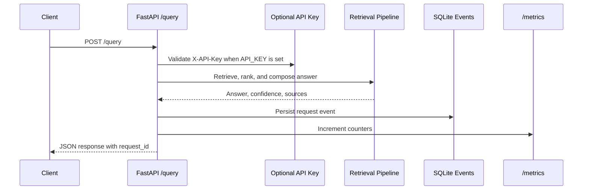
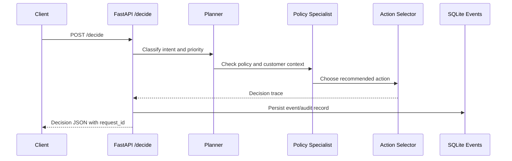
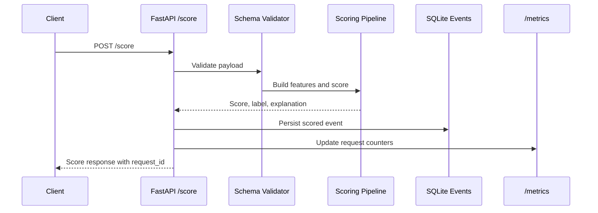
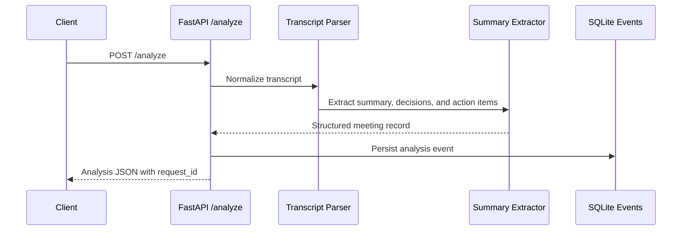
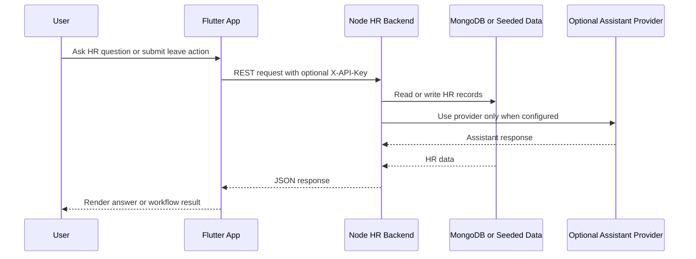
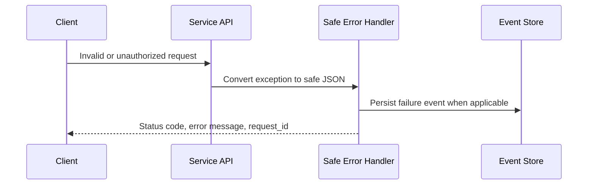

# API Flow Diagrams

These flows show how an external reviewer can reason about each API without
reading the full implementation first. The common hardening path is repeated
across services: request ID, optional API key, domain logic, JSON response,
metrics, and event/audit persistence.

## Retrieval Query

Repository: `enterprise-rag-knowledge-system`

## Customer Operations Decision

Repository: `ai-proactive-customer-operations`

## Scoring Services

Repositories: `ai-incident-detection-platform`, `ai-sales-intelligence-engine`

## Meeting Intelligence

Repository: `autonomous-meeting-intelligence`

## ADAAS HR Assistant

Repository: `ADAAS`

## Common Error Path

