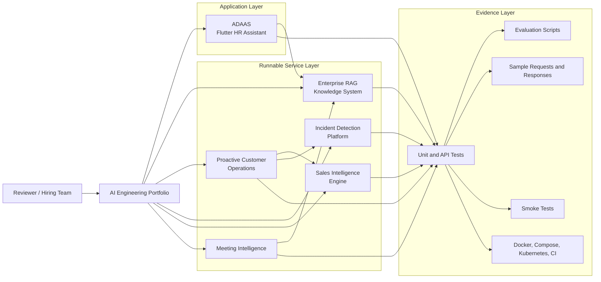
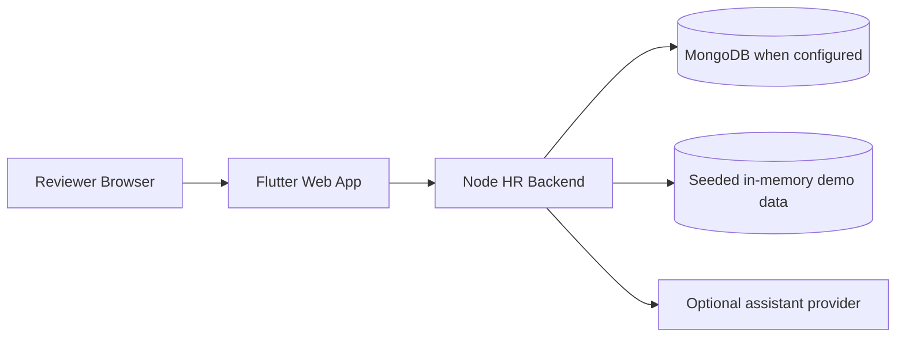
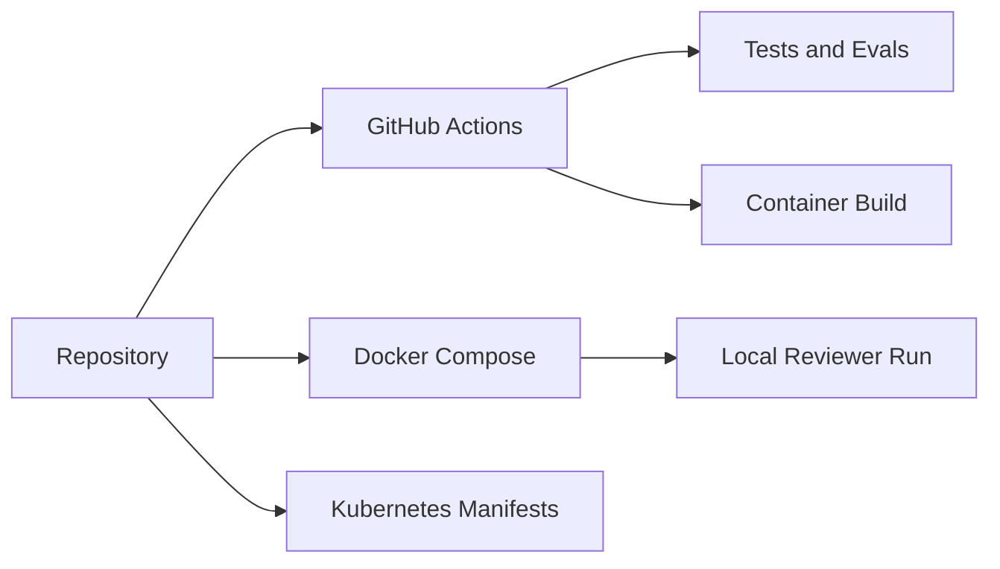

# Portfolio Architecture

This portfolio is organized as a set of focused, independently runnable systems.
Each repository demonstrates one production engineering concern: retrieval,
workflow orchestration, scoring, anomaly detection, transcript understanding, or
application integration.

## System Landscape



## Shared Service Architecture

The five Python services use a common FastAPI baseline: typed request handling,
optional API key protection, request IDs, safe JSON errors, metrics, event
persistence, tests, evaluation scripts, and container/deployment manifests.

```mermaid
flowchart TD
  Client[Client or curl]
  Auth[Optional API key check]
  RequestID[Request ID middleware]
  Route[FastAPI route]
  Domain[Domain pipeline]
  Store[(SQLite event store)]
  Metrics[/metrics JSON]
  Error[Safe JSON error handler]
  Response[Typed JSON response]

  Client --> Auth --> RequestID --> Route --> Domain --> Response
  Domain --> Store
  Route --> Metrics
  Route -. exceptions .-> Error --> Response
```

## ADAAS Architecture

ADAAS adds a user-facing Flutter layer and a Node backend. The backend keeps the
same reviewer-friendly operational baseline: health checks, metrics, API key
support, smoke tests, Docker Compose, Kubernetes manifests, and CI.



## Deployment Baseline



These projects are intentionally local-first. They are credible deployable
baselines, but they do not include live cloud environments or production data.
