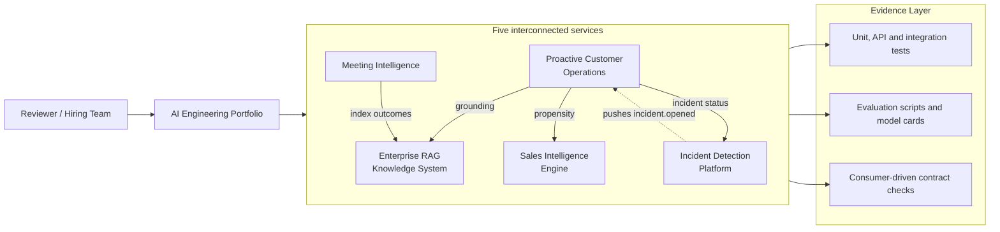
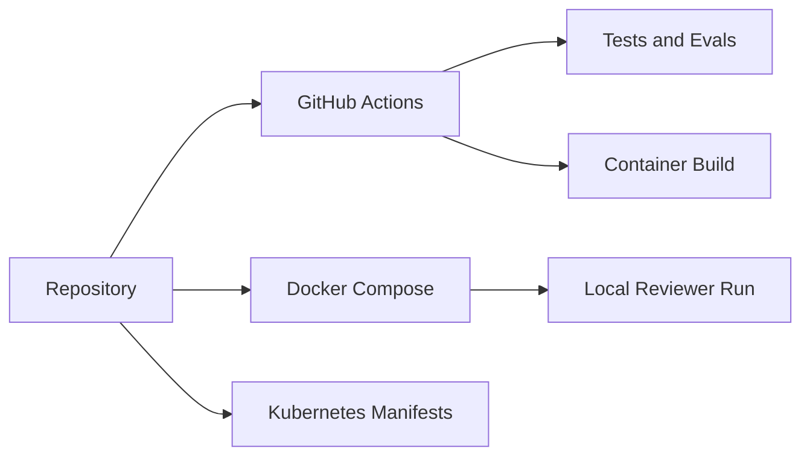

# Portfolio Architecture

This portfolio is organized as a set of focused, independently runnable systems.
Each repository demonstrates one production engineering concern: retrieval,
workflow orchestration, scoring, anomaly detection, transcript understanding, or
application integration.

## System Landscape

```mermaid
flowchart LR
  Reviewer[Reviewer / Hiring Team]
  Portfolio[AI Engineering Portfolio]

  subgraph Services[Five interconnected services]
    RAG[Enterprise RAG
Knowledge System]
    OPS[Proactive Customer
Operations]
    INCIDENT[Incident Detection
Platform]
    SALES[Sales Intelligence
Engine]
    MEETING[Meeting Intelligence]
  end

  subgraph Evidence[Evidence Layer]
    Tests[Unit, API and integration tests]
    Evals[Evaluation scripts and model cards]
    Contracts[Consumer-driven contract checks]
  end

  Reviewer --> Portfolio
  Portfolio --> Services

  OPS -->|propensity| SALES
  OPS -->|incident status| INCIDENT
  OPS -->|grounding| RAG
  MEETING -->|index outcomes| RAG
  INCIDENT -.->|pushes incident.opened| OPS

  Services --> Tests
  Services --> Evals
  Services --> Contracts
```

## Shared Service Architecture

The five Python services use a common FastAPI baseline: typed request handling,
optional API key protection, request IDs, safe JSON errors, metrics, event
persistence, tests, evaluation scripts, and container/deployment manifests.

```mermaid
flowchart TD
  Client[Client or curl]
  Auth[Optional API key check]
  RequestID[Request ID middleware]
  Route[FastAPI route]
  Domain[Domain pipeline]
  Store[(SQLite event store)]
  Metrics[/metrics JSON]
  Error[Safe JSON error handler]
  Response[Typed JSON response]

  Client --> Auth --> RequestID --> Route --> Domain --> Response
  Domain --> Store
  Route --> Metrics
  Route -. exceptions .-> Error --> Response
```

## Deployment Baseline

```mermaid
flowchart LR
  Repo[Repository]
  CI[GitHub Actions]
  Tests[Tests and Evals]
  Image[Container Build]
  Compose[Docker Compose]
  K8s[Kubernetes Manifests]
  Local[Local Reviewer Run]

  Repo --> CI --> Tests
  CI --> Image
  Repo --> Compose --> Local
  Repo --> K8s
```

These projects are intentionally local-first. They are credible deployable
baselines, but they do not include live cloud environments or production data.

## Evaluation Design

The architectural decision that matters most across these repositories is not in
any diagram: each evaluation is built so it can fail.

| Repository | Split | Why that split |
|---|---|---|
| `ai-sales-intelligence-engine` | 75/25 stratified | Independent rows; the Bayes ceiling is reported so the metric is interpretable |
| `ai-incident-detection-platform` | **Chronological per service** | Incidents span consecutive minutes; a random split leaks an episode's middle into training |
| `ai-proactive-customer-operations` | **Held-out templates** | A row split lets the classifier memorise phrasings present on both sides (it scored 1.00) |
| `autonomous-meeting-intelligence` | **Held-out templates** | Same reason |
| `enterprise-rag-knowledge-system` | Public BEIR test qrels | Human relevance judgments, comparable to published results |

Each repository also scores the thing it replaced — the keyword gate, the z-score
baseline, the naive row split — on the same held-out data, so improvements are
measured rather than asserted.
